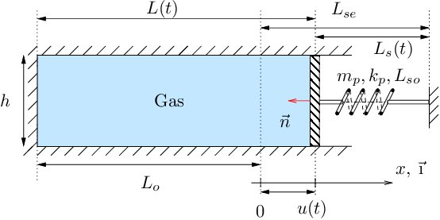
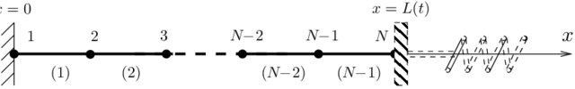

# fsi_piston

This is the C++ implementation of the fluid-structure interaction problem from [Emmanuel Lefrançois and Jean-Paul Boufflet (2010)](http://dx.doi.org/10.1137/090758313). (The C-Model for now).

It is based on the  [Matlab code](http://www.utc.fr/~elefra02/ifs/funcref.html) written by the authors.


<p align="center">
  <a href="https://github.com/azzeddinetiba/fsi_piston">
    
  </a>

</p>

<p align="center">
  <a href="https://github.com/azzeddinetiba/fsi_piston">
    
  </a>

</p>

## Prerequisites

You need to include the [Eigen](https://eigen.tuxfamily.org/index.php?title=Main_Page) library along with the header files, and indicate it to your compiler :
```sh
gcc -I XXX/eigen-3.4.0 ...
```
## Usage

After executing the executables generated, results will be loaded into a ``` ./Results/``` folder, i.e text files containing time history of the pressure, the velocity, timesteps and the density fields in the fluid domain.

